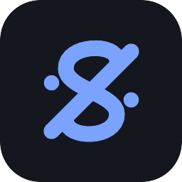
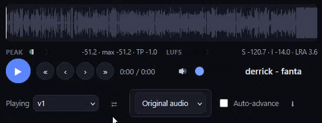

<p align="center">
  
</p>

<h1 align="center">alsegno</h1>

<p align="center">
  <em>Lightweight, self-hosted A/B review for audio & video revisions.</em>
</p>

<p align="center">
  <a href="LICENSE"></a>
  
  
</p>

---

**alsegno** *(al-SEHN-ya)* is a small collaborative review tool for people who send in-production media files back and forth — mixing & mastering engineers, producers, and video/post editors, and their clients. Upload new revisions, and your reviewers compare it **A/B** against a previous one.  Pin **timestamped notes** to the exact frame, and track how *done* each piece feels. Self-hosted, no sign-ups, no SaaS.

<p align="center">
  
  <br><sub><em>A/B-ing two revisions — same playhead, instant compare.</em></sub>
</p>

## Why did I make this?

Emailing `whatever_v3_r09.mp3` around and getting back "the twangy part is too loud" can get complicated really fast. You can have a conversation about it, but then you have to either scroll back and find everything between chit chat, or write it all down separately and read off of that, I guess...  Or you could use this thing, which keeps the audio, the versions, and the feedback in one place, anchored to the timeline where everyone involved can see it.  It works really well and I wish I had it sooner.

## Features

**Listening & comparison**

- **Gapless A/B** — switch between two revisions mid-playback, so you can immediately hear the difference.
- **EBU R128 loudness metering** — integrated LUFS, LRA, and true-peak, plus a short-term LUFS readout that follows the playhead. Program-level, independent of your playback volume.
- **Waveform** with a clickable, scrubbable playhead.
- **Null test** — play revision A summed with a phase-inverted B to hear what changed between two versions. Not super useful but it's there if you need it.

**Feedback**

- **Timestamped notes** — pin a comment to an exact moment; it appears as a 𝄋 marker on the waveform. General notes and threaded replies too, with edit / soft-delete.
- **Doneness** — a per-track "how done is this?" slider that rolls up into a project progress bar.
- **Export notes to your DAW / editor** — turn timed notes into marker/locator files for **Audacity, Reaper, FL Studio, Cubase/Nuendo, Avid, and DaVinci Resolve** (record-timecode aware).

**Audio *and* video**

- Video projects get a video stage with **frame-stepping** (`m:ss:ff`) and an instant-scrub proxy. Editors can review cuts and audio-for-picture with the same timestamped-notes workflow. It's really fast, too.

**Running it**

- **Self-hosted & private** — your files, your server. Mounts cleanly behind a reverse proxy at a subpath.
- **No build step** — one Express server + one HTML/JS page, backed by SQLite. The only runtime dependency is `ffmpeg`.
- **Live** — comments, new revisions, and doneness sync to everyone in real time over SSE. It's like a chat room for your projects.
- **Simple access** — invite links + trust-on-first-use passwords (no public sign-up); per-project membership with **admin / engineer / client** roles. It's secure and really simple.

## Quick start

**Download a release** — no git, no Docker, the easiest way:

1. Grab the latest `alsegno-x.y.z.zip` from the [**Releases**](https://github.com/fjamesprice/alsegno/releases/latest) page and unzip it.
2. From the unzipped `alsegno` folder, run the installer:
   - **macOS** — `./install.sh` in Terminal (or double-click `start-macos.command`; if macOS blocks it as "unidentified", run `xattr -dr com.apple.quarantine .` in the folder first, or use **System Settings → Privacy & Security → Open Anyway**)
   - **Windows** — double-click `start-windows.cmd`
   - **Linux** — `./install.sh`

It checks for **Node ≥ 18** and `ffmpeg`/`ffprobe`, prints a one-line install hint if either is missing, writes a `.env` with a random secret, and offers to start the app on boot. Then open the URL it prints (default http://localhost:3458).

<details>
<summary>Prefer git, or Docker?</summary>

**git clone** (same installer, always the latest code, updates with `git pull`):

```bash
git clone https://github.com/fjamesprice/alsegno.git
cd alsegno
./install.sh          # Linux / macOS   (Windows: install.ps1)
```

**Docker** (Node + ffmpeg baked into the image):

```bash
git clone https://github.com/fjamesprice/alsegno.git
cd alsegno
SESSION_SECRET=$(openssl rand -hex 48) docker compose up -d --build
# then open http://localhost:3458
```
</details>

The **first login** for the admin account sets its password (trust-on-first-use). Services, reverse-proxy/HTTPS, and all configuration are covered in **[INSTALL.md](INSTALL.md)**.

## How it works

There's not a whole lot to it, so it should be fairly intuitive. A project holds **tracks** (one for a single, many for an album/EP); each track holds **revisions** (v1, v2, …). On upload, alsegno transcodes to a 320 kbps MP3 preview (optionally keeping your lossless original for download), decodes the waveform, and runs an `ffmpeg ebur128` loudness pass — all stored alongside the revision. The player reads those precomputed values at the playhead, so the meters are exact and volume-independent.

*`Note: Because previews are lossy MP3, the null test leaves a faint residual hiss even where nothing changed — that's expected; real mix moves sit well above it.`*

## Tech

`Node` + `Express` · `better-sqlite3` (synchronous, single file) · a vanilla **Canvas + Web Audio** frontend · `ffmpeg`/`ffprobe` for transcoding and analysis. No framework, no bundler, no build — essentially one backend file and one frontend file.

## Configuration

Settings live in `.env` — `PORT`, `SESSION_SECRET`, and optional `HOST`, `DATA_DIR`, `UPLOADS_DIR`. See **[INSTALL.md](INSTALL.md)**.

## Contributing

Issues and PRs welcome. alsegno is deliberately small and dependency-light — please keep changes in that spirit (no build step, no heavy frameworks).

## License

[MIT](LICENSE) © 2026 F. James Price
